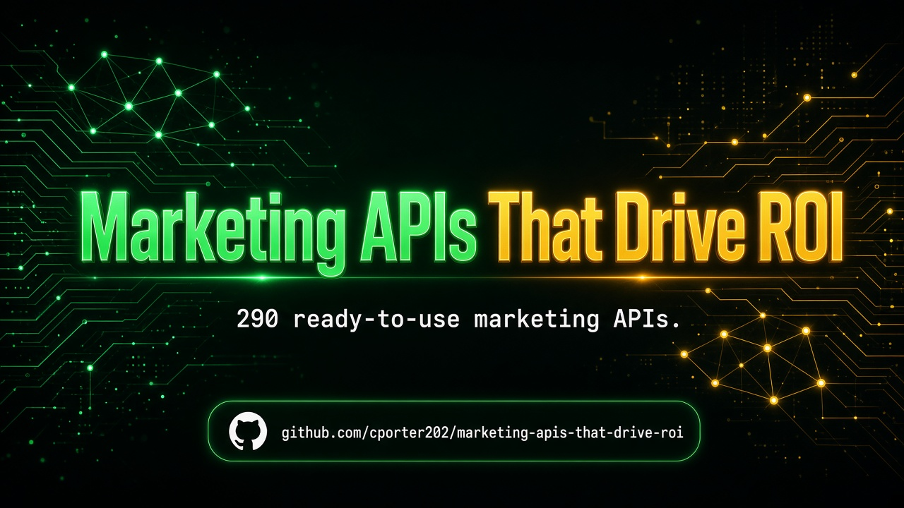

 
 

  <a href="#at-a-glance"><strong>At A Glance</strong></a>
  |
  <a href="#start-here"><strong>Start Here</strong></a>
  |
  <a href="#explore-the-stack"><strong>Explore The Stack</strong></a>
  |
  <a href="#why-this-repo-wins"><strong>Why This Repo Wins</strong></a>
  |
  <a href="#star-history"><strong>Star History</strong></a>

### 🚀 Join My Skool Community

**Want to learn how to vibe code like the pros? Join my Skool community! 🎯**

*I'll show you how to set up applications to use these APIs and start making money! I have the best tech stack when it comes to vibe coding that virtually costs nothing. Forget tools like Loveable, Replit, Manus, Base44, etc.*

 

  <a href="https://www.skool.com/vibe-coding-with-chris-7196" target="_blank" style="display: inline-block; background: #667eea; background-image: linear-gradient(135deg, #667eea 0%, #764ba2 100%); color: #ffffff !important; text-decoration: none !important; padding: 18px 45px; font-size: 18px; font-weight: bold; border-radius: 35px; box-shadow: 0 8px 25px rgba(102, 126, 234, 0.5); letter-spacing: 1px; text-transform: uppercase; border: 2px solid rgba(255, 255, 255, 0.3); cursor: pointer; font-family: -apple-system, BlinkMacSystemFont, 'Segoe UI', Helvetica, Arial, sans-serif;">
    🚀 Join Vibe Coding Community →
  </a>

## At A Glance

> The ultimate collection of marketing APIs — ads intel, SEO, brand sentiment, and PR data that make spend smarter. **290 production-ready APIs** across **5 navigable sections**.

This repository is designed to feel like a launchpad, not a junk drawer. Pick a section folder, scan the API table, and click through to the provider — no endless flat scrolling.

| Metric | Count |
|--------|-------|
| Total APIs | 290 |
| Categories | 5 |
| Last Updated | 2026-09-16 |
| Focus | Marketing ROI |

<table>
  <tr>
    <td width="33%" valign="top">
      <h3>Ads & Campaigns</h3>
      
<strong>28 APIs</strong>

      
Ad library scrapers, creative intel, and campaign research tooling.

      
<a href="./ads-campaigns/"><strong>Open Ads & Campaigns Directory</strong></a>

    </td>
    <td width="33%" valign="top">
      <h3>SEO & Content</h3>
      
<strong>71 APIs</strong>

      
Rank tracking, SERP data, keywords, backlinks, and content SEO/GEO.

      
<a href="./seo-content/"><strong>Open SEO & Content Directory</strong></a>

    </td>
    <td width="33%" valign="top">
      <h3>Brand & Sentiment Monitoring</h3>
      
<strong>86 APIs</strong>

      
Brand mentions, reviews, reputation, and sentiment monitoring.

      
<a href="./brand-sentiment-monitoring/"><strong>Open Brand & Sentiment Monitoring Directory</strong></a>

    </td>
  </tr>
  <tr>
    <td width="50%" valign="top">
      <h3>Press & PR</h3>
      
<strong>11 APIs</strong>

      
Press releases, news monitoring, and PR / media outreach data.

      
<a href="./press-pr/"><strong>Open Press & PR Directory</strong></a>

    </td>
    <td width="50%" valign="top">
      <h3>Other Marketing Tools</h3>
      
<strong>94 APIs</strong>

      
Email deliverability, competitive intel, attribution helpers, and misc marketing APIs.

      
<a href="./other-marketing-tools/"><strong>Open Other Marketing Tools Directory</strong></a>

    </td>
    <td width="50%"></td>
  </tr>
</table>

## Start Here

1. Pick the section you need first from the cards above.
2. Open that folder's README and scan the API names and descriptions.
3. Click through to the provider page for implementation details, pricing, and docs.
4. Build your shortlist fast instead of wasting hours digging through a flat list.

## Explore The Stack

<strong>Ads & Campaigns</strong> (28)

Ad library scrapers, creative intel, and campaign research tooling.

- Meta / Google ads intel
- creative research
- campaign monitoring
- spend / bidding signals

[Browse Ads & Campaigns APIs](./ads-campaigns/)

<strong>SEO & Content</strong> (71)

Rank tracking, SERP data, keywords, backlinks, and content SEO/GEO.

- SERP / rank tracking
- keywords and backlinks
- technical SEO
- AI Overviews / GEO

[Browse SEO & Content APIs](./seo-content/)

<strong>Brand & Sentiment Monitoring</strong> (86)

Brand mentions, reviews, reputation, and sentiment monitoring.

- brand mentions
- review scrapers
- sentiment scoring
- reputation monitoring

[Browse Brand & Sentiment Monitoring APIs](./brand-sentiment-monitoring/)

<strong>Press & PR</strong> (11)

Press releases, news monitoring, and PR / media outreach data.

- press releases
- news monitoring
- media lists
- PR outreach data

[Browse Press & PR APIs](./press-pr/)

<strong>Other Marketing Tools</strong> (94)

Email deliverability, competitive intel, attribution helpers, and misc marketing APIs.

- email deliverability
- competitive intel
- attribution helpers
- misc marketing utilities

[Browse Other Marketing Tools APIs](./other-marketing-tools/)

## Built For

<table>
  <tr>
    <td width="25%" align="center"><strong>Growth Marketers</strong></td>
    <td width="25%" align="center"><strong>Performance Teams</strong></td>
    <td width="25%" align="center"><strong>SEO Agencies</strong></td>
    <td width="25%" align="center"><strong>Brand Managers</strong></td>
  </tr>
  <tr>
    <td width="25%" align="center"><strong>In-House CMOs</strong></td>
    <td width="25%" align="center"><strong>Demand Gen</strong></td>
    <td width="25%" align="center"><strong>PR Teams</strong></td>
    <td width="25%" align="center"><strong>Analytics Builders</strong></td>
  </tr>
</table>

## Why This Repo Wins

- It is opinionated. Sections map to how builders actually search for APIs.
- It is navigable. Top-level folders beat one giant markdown table every time.
- It is faster to use. Jump straight to the category that matches your use case.
- It keeps affiliate tracking intact (`?fpr=p2hrc6`) on every link.
- Custom SVG hero — no blurry PNG banner.

## Scope Guarantee

This repository intentionally organizes APIs into:

**Ads & Campaigns**, **SEO & Content**, **Brand & Sentiment Monitoring**, **Press & PR**, **Other Marketing Tools**

Unmatched rows land in the `other-*` catch-all so **zero APIs are dropped**.

## Follow the Creator

See [FOLLOW_CREATOR.md](./FOLLOW_CREATOR.md) — follow Chris Porter on Facebook for more valuable repos and updates.

## Star History

## Maintenance Notes

- Section classification is keyword-based on API name + description.
- Every original table row is preserved exactly, including affiliate params.
- Visual launchpad layout matches the style of [agentic-ai-apis](https://github.com/cporter202/agentic-ai-apis).
